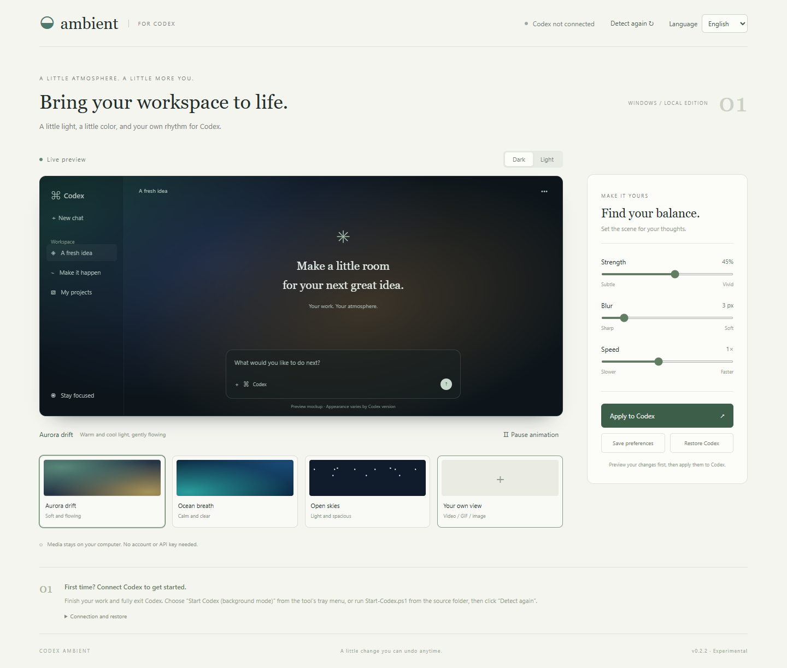

# Codex Ambient

[繁體中文](README.md) | **English**

Animated backgrounds for the Codex desktop app on Windows. Preview aurora, ocean and starfield animations, or use local videos, GIFs and images. Adjust background strength, blur and speed, pause playback, and restore the original appearance with one click.

This is an unofficial, experimental appearance tool. It is not affiliated with OpenAI. The interface supports English and Traditional Chinese.



## Download and use

Download `CodexAmbient.exe` from [Releases](https://github.com/firzenfu/codex-ambient/releases). The executable is approximately 34 MB and includes Node.js. No separate Node.js installation, npm packages or administrator privileges are required.

Choose **English** in the language selector at the top right of the control panel. The interface, preview text and messages change immediately, without restarting your background or video. Your choice is saved automatically and restored the next time you open the tool. The EXE tray menu uses the same preference when you next open the menu.

When upgrading, quit the previous Ambient version from its tray menu before opening the new EXE.

1. Double-click the EXE to open the live preview. It uses a standalone Microsoft Edge app window, falling back to your default browser if Edge is unavailable.
2. Finish your current work and fully exit Codex, including its system tray process.
3. Right-click the Ambient tray icon and choose **啟動 Codex（背景模式）** (Start Codex in background mode). The launcher does not force-close a running Codex instance.
4. In the control panel, click **重新偵測** (Detect again), select the correct Codex window, adjust the effect, and click **套用至 Codex** (Apply to Codex).

You can also open `http://127.0.0.1:43127/` in Codex's built-in browser to use the same preview in the side panel. Sliders update the preview first; the app background changes when you apply it.

Closing the preview window leaves Ambient in the system tray. Right-click its icon to reopen the preview or choose **離開工具** (Quit). Quitting stops only the control-panel server started by the tool; it does not terminate Codex.

## Codex plugin (v0.4.0)

The **Codex Ambient personal plugin** appears in Codex's plugin directory and provides conversational controls for preview, presets, restore and language. Its helper starts automatically when Codex loads the plugin MCP session, so the plugin does not need a separately opened Ambient EXE.

Extract the plugin ZIP and run `Install-Plugin.ps1` with PowerShell. Restart Codex after finishing your work, then find **Codex Ambient** under the **Codex Ambient · 本機外掛** local source. See the [plugin guide](plugins/codex-ambient/README.md) for installation and removal. The package has not been published to the public plugin directory.

**Background mode is still required.** The plugin cannot enable debugging inside an already-running Codex. Continue launching Codex with the package's `Start-Codex.ps1` or the existing **Codex + Ambient** shortcut. The MCP session may load later than the app window. Ordinary Codex launches support preview but cannot apply a background.

Run `npm run build:plugin` to build the Windows x64 ZIP with its bundled Node runtime. The release uses the `.codex-plugin/plugin.json` and `.mcp.json` compatibility layout verified with Codex 26.928; the portable source manifest is a build input. The standalone EXE and helper remain v0.3.0.

## One-click launch (v0.3.0)

Open the EXE once, then right-click its tray icon and choose **Create one-click shortcut**. Use the new **Codex + Ambient** desktop shortcut for everyday launches. It starts the local helper and Codex in background mode, then restores your last applied or saved background without opening the control panel. Repeated clicks reuse the running helper.

Use **Open background preview** from the tray menu when you want to change the effect. **Apply to Codex** also saves it for future launches. **Save preferences** saves the next-launch choice without changing the current background. Selected media is saved locally with the settings, so it can resume after a restart. Media selected in older versions must be selected and saved once in this version.

While one-click mode is active, background reconnection and page reloads are handled automatically. Existing playback is left running. **Restore Codex** disables automatic restoration until you apply or save a background again and launch it as appropriate.

If Codex is already running in ordinary mode, finish your work and fully exit it once, then use the new shortcut. The tool never force-closes Codex. Its original shortcut continues to launch ordinary mode. There is no Windows sign-in startup task. Keep the EXE at the shortcut's target location, or recreate the shortcut after moving it.

For scripts, use `CodexAmbient.exe --launch-codex`. Use `CodexAmbient.exe --create-shortcut` to create the desktop shortcut. Running the EXE without arguments opens the control panel.

## Restore and data locations

- Click **還原 Codex** (Restore Codex) to remove the selected window's background layer, styles, animations and event listeners.
- Reloading the Codex page clears its injected layer; one-click mode restores it automatically while the helper is running.
- To close the debugging interface, fully exit Codex and reopen it using its original shortcut.
- The EXE extracts its runtime to `%LOCALAPPDATA%/CodexAmbient/engine-…` and stores settings in `%LOCALAPPDATA%/CodexAmbient/settings/`.
- When running from source, settings are stored in the project's `data/settings.json`.
- The saved background and local media are stored in `settings.json`. The language preference is stored separately in `ui.json` in the same settings directory, so changing it preserves your background preferences.
- Applied or saved media is stored locally inside the settings file and is never uploaded. Files are limited to 20 MB before encoding.
- The tool does not modify `app.asar`, conversations or sign-in data. Plugin installation registers its marketplace and enablement settings through the Codex CLI.

## Compatibility and limitations

- Requires Windows x64 and .NET Framework 4.5 or later, normally included with Windows 10/11. The EXE launcher automatically locates the Microsoft Store version of Codex.
- Uses Electron's [local debugging connection](https://www.electronjs.org/docs/latest/api/command-line-switches#--remote-debugging-portport), rather than an official background API. The debugging interface can control the app: use it only on your own computer and do not forward port 9223 to the network.
- The control panel listens only on `127.0.0.1`. Requests that change state require origin validation and a fresh token generated at each startup.
- The main window and an installed media background were successfully detected in Codex `26.928.1915.0`. Visual behavior has not been fully verified across all versions and pages; app updates may affect compatibility.
- Only the main `app://-/` or `app://-/index.html` windows are eligible. Ordinary webpages, sign-in pages and embedded browsers are excluded.
- Some code blocks, menus and side panels keep their original background colors. A background strength of 20–40% is suggested; reapply after switching between light and dark themes.
- Media files are limited to 20 MB. Supported formats are MP4, WebM, GIF, PNG, JPG and WebP. Video codecs must also be supported by the app.
- GIFs can be paused but cannot have their speed changed. Speed controls apply to generated animations and videos. The tool respects the system's reduced-motion setting and pauses animations when the page is hidden.
- Automatic restoration is enabled by the one-click launcher or the tray launch command, with no Windows sign-in startup task. The EXE is not code-signed; releases include a SHA-256 checksum file.

## Run from source

Requires Node.js 22 or later. No `npm install` is needed:

```powershell
node server.mjs
```

Open `http://127.0.0.1:43127/`, or double-click `Open-Ambient.cmd` to start the tool.

Use `Start-Codex.ps1` or `Open-Codex-With-Ambient.cmd` to launch Codex in background mode. For another installation location, specify its executable:

```powershell
.\Start-Codex.ps1 -CodexPath 'Full path to the Codex executable'
```

If your organization's policy prohibits PowerShell scripts, follow that policy. You can use the EXE or manually launch Codex with `--remote-debugging-address=127.0.0.1 --remote-debugging-port=9223`.

## Test and build

```powershell
npm test
npm run build:exe
```

Building the EXE requires Windows x64 and Node.js **v24.18.0**. It uses Windows' .NET Framework C# compiler; the .NET SDK is not required. The executable and SHA-256 checksum are written to `dist/`.

Optional browser integration checks require Playwright and Edge:

```powershell
npm install --no-save --package-lock=false playwright
node tests/browser-check.mjs
```

Browser checks use an isolated control panel and a mock debugging service, without modifying a running Codex instance. They cover presets, pause, light/dark themes, image/GIF/WebM loading, narrow layouts, CDP transport, and applying, switching and restoring backgrounds in an isolated page. Unit and HTTP tests also cover target selection, media limits, origin checks, saving settings and recovery from corrupted settings.

Run a standalone, headless EXE startup smoke test with the following command. Results are written to the specified directory:

```powershell
.\dist\CodexAmbient.exe --smoke-test --data-dir "$PWD\test-results\exe-smoke"
```

## Project structure

| Path | Purpose |
| --- | --- |
| `server.mjs` | Local control panel, settings storage and apply API |
| `lib/` | Input validation and local-only CDP connection |
| `public/` | English/Traditional Chinese interface, translations, shared background renderer and icons |
| `packaging/` | Windows EXE launcher and build script |
| `tests/` | Unit, HTTP and browser integration checks |

The complete license text for the bundled Node.js runtime is preserved in `packaging/NODE-LICENSE.txt`, sourced from [Node.js v24.18.0](https://github.com/nodejs/node/blob/v24.18.0/LICENSE), and extracted with the EXE. Update this license file when updating the runtime.
