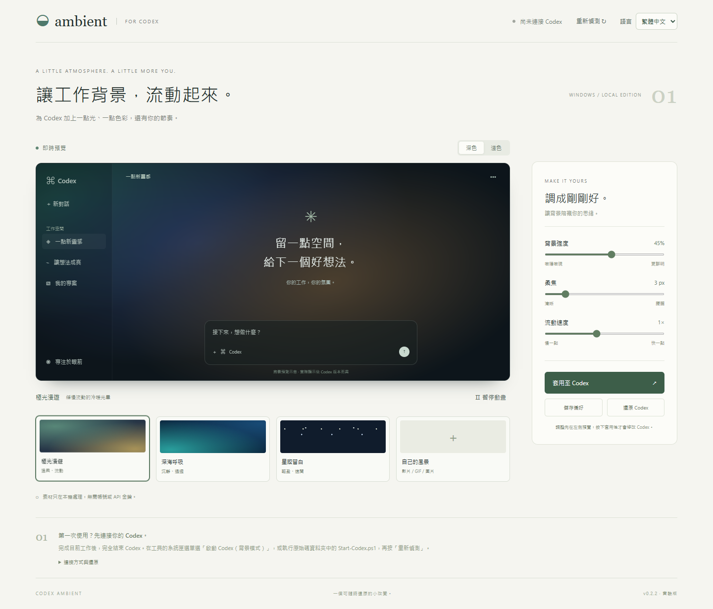

# Codex Ambient

Windows Codex 桌面 App 的動態背景工具。支援即時預覽、極光／海洋／星空動畫、本機影片、GIF 和圖片，以及背景強度、柔焦、速度、暫停與一鍵還原。

這是非官方的實驗性外觀工具，與 OpenAI 無隸屬關係。



## 下載與使用

從 [Releases](https://github.com/firzenfu/codex-ambient/releases) 下載 `CodexAmbient.exe`。EXE 約 34 MB，已內附 Node.js；不需要另外安裝 Node.js、npm 套件或取得系統管理員權限。

1. 雙擊 EXE，開啟即時預覽。使用 Microsoft Edge 的獨立應用程式視窗，未安裝 Edge 時改用預設瀏覽器。
2. 完成目前工作並完全結束 Codex（包含系統匣）。
3. 在 Ambient 系統匣圖示按右鍵，選「啟動 Codex（背景模式）」。不會強制關閉正在執行的 Codex。
4. 控制台按「重新偵測」，選擇正確的 Codex 視窗，調整效果後按「套用至 Codex」。

在 Codex 的內建瀏覽器開啟 `http://127.0.0.1:43127/`，也能在右側使用同一套預覽。滑桿先更新預覽，按「套用」後才改變 App。

關閉預覽視窗後工具會留在系統匣。右鍵可以重新開啟預覽或「離開工具」。退出只會停止工具自己啟動的控制台服務，不會終止 Codex。

## 還原與資料位置

- 按「還原 Codex」可移除該視窗的背景層、樣式、動畫及事件監聽器。
- 重新載入 Codex 頁面或完全結束 App，也會清除背景。之後需重新套用。
- 要關閉偵錯介面，完全結束 Codex，從原本捷徑重新開啟。
- EXE 的執行環境解開至 `%LOCALAPPDATA%/CodexAmbient/engine-…`，設定存於 `%LOCALAPPDATA%/CodexAmbient/settings/`。
- 原始碼啟動方式的設定存於專案的 `data/settings.json`。
- 素材只在記憶體中處理，不上傳；下次開啟控制台需重新選擇素材。
- 不修改 `app.asar`、Codex 設定檔、對話或登入資料。

## 相容性與限制

- Windows x64、.NET Framework 4.5 以上；Windows 10／11 一般已內建。EXE 啟動器自動尋找 Microsoft Store 版 Codex。
- 使用 Electron 的 [本機偵錯連線](https://www.electronjs.org/docs/latest/api/command-line-switches#--remote-debugging-portport)，並非官方背景 API。偵錯介面可控制 App，請只在自己的電腦使用，勿將 9223 連接埠轉送到網路。
- 控制台只監聽 `127.0.0.1`，修改操作需要來源驗證及每次啟動的新權杖。
- 曾成功偵測 Codex `26.928.1915.0` 的主視窗及已安裝的素材背景。沒有對所有版本和頁面做完整視覺驗證；App 更新可能影響相容性。
- 只選取 `app://-/` 或 `app://-/index.html` 主視窗，不會套用至一般網頁、登入頁或內嵌瀏覽器。
- 部分程式碼、選單與側面板保留原本底色。建議背景強度 20–40%，深淺色切換後重新套用。
- 素材上限 20 MB。支援 MP4、WebM、GIF、PNG、JPG、WebP，實際影片編碼須由 App 支援。
- GIF 支援暫停但不調速；速度適用於程式動畫和影片。遵循系統「減少動態效果」設定，頁面隱藏時暫停動畫。
- 沒有開機自啟或自動注入。EXE 尚未做商業程式碼簽署；Release 附 SHA-256 校驗檔。

## 從原始碼啟動

需要 Node.js 22 以上，不需要 `npm install`：

```powershell
node server.mjs
```

開啟 `http://127.0.0.1:43127/`。也可以雙擊 `Open-Ambient.cmd`。

Codex 的原始碼啟動器為 `Start-Codex.ps1`（或 `Open-Codex-With-Ambient.cmd`）。其他安裝位置可指定：

```powershell
.\Start-Codex.ps1 -CodexPath '完整的 Codex 執行檔路徑'
```

如果組織原則禁止 PowerShell 腳本，請遵循組織原則；可以使用 EXE 版，或手動以 `--remote-debugging-address=127.0.0.1 --remote-debugging-port=9223` 啟動 Codex。

## 測試與建置

```powershell
npm test
npm run build:exe
```

EXE 建置需要 Windows x64、Node.js **v24.18.0**，使用 Windows 內建的 .NET Framework C# 編譯器，不需要 .NET SDK。成品與 SHA-256 校驗檔在 `dist/`。

可選的瀏覽器整合檢查需要 Playwright 和 Edge：

```powershell
npm install --no-save --package-lock=false playwright
node tests/browser-check.mjs
```

瀏覽器測試使用獨立控制台與模擬偵錯服務，不會修改正在執行的 Codex。涵蓋預設效果、暫停、深淺色、圖片／GIF／WebM 載入、窄螢幕排版、CDP 傳輸與隔離頁面的套用／切換／還原。單元與 HTTP 測試另檢查目標選擇、素材限制、來源驗證、設定保存及損壞設定回復。

EXE 可用下列方式進行無介面的獨立啟動測試，結果寫入指定資料夾：

```powershell
.\dist\CodexAmbient.exe --smoke-test --data-dir "$PWD\test-results\exe-smoke"
```

## 專案內容

| 路徑 | 用途 |
| --- | --- |
| `server.mjs` | 本機控制台、設定保存、套用 API |
| `lib/` | 輸入驗證及限定本機的 CDP 連線 |
| `public/` | 繁體中文介面、共用背景引擎、圖示 |
| `packaging/` | Windows EXE 啟動器與封裝腳本 |
| `tests/` | 單元、HTTP 與瀏覽器整合檢查 |

內附 Node.js 的完整授權文件保留於 `packaging/NODE-LICENSE.txt`，來源為 [Node.js v24.18.0](https://github.com/nodejs/node/blob/v24.18.0/LICENSE)，並隨 EXE 解開。更新執行環境時須同步更新授權文件。
